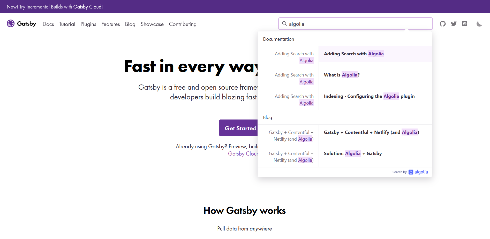

Gatsby has a [plugin](https://github.com/algolia/gatsby-plugin-algolia) for adding Algolia search to your site (of course they do).

They event use Algolia for search on [gatsbyjs.org](https://www.gatsbyjs.org/)

If you want to add search to a Gatsby site using algolia, they have a handy dandy [guide](https://www.gatsbyjs.org/docs/adding-search-with-algolia/).
