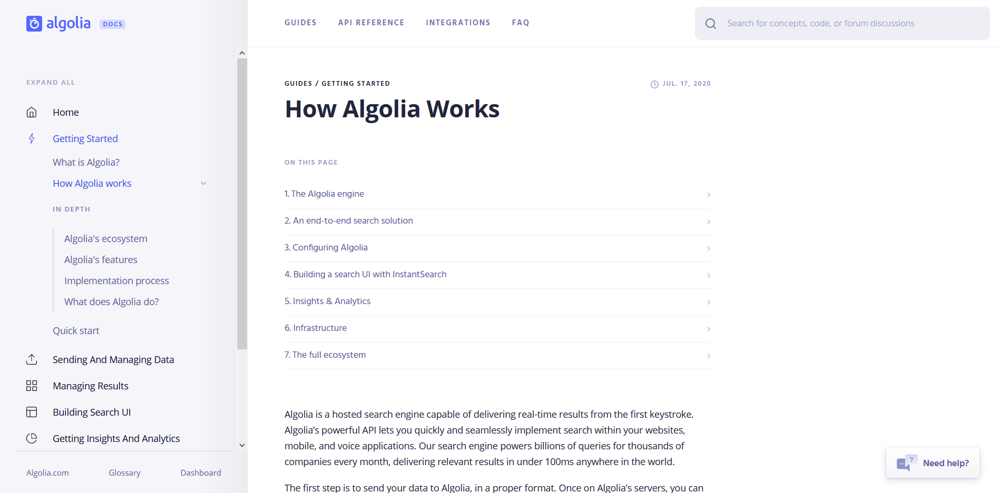

[Algolia](https://www.algolia.com/) is a site search hosting platform and API that provides you with the components you need to build powerful search functionality without setting up your own server.

Algolia will host the search index. You tell it what pages you have, where they are and how to navigate them, and the Algolia API will return those results to the user based on whatever search terms they use.
